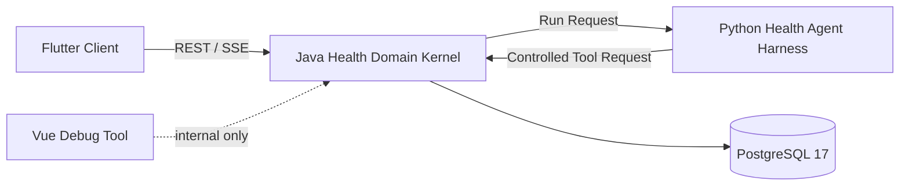

<div align="center">

# reboot-health

### AI-native personal health system powered by a domain-specific Agent Harness

<p>
  
  
  
  
  
</p>

**Python 决定下一步应该做什么，Java 决定什么允许做并可靠保存，Flutter 负责用户如何表达、确认和行动。**

</div>

> `reboot-health` 不是“健康后台加一个聊天框”，而是围绕个人健康场景建设的一套可控制、可观察、可验证的 **Harness Engineering** 实践。

本项目不做医学诊断，也不替代医生意见。

## ✨ Why this project

项目重点不是训练新模型，而是让现有模型在健康领域中具备可靠的运行环境：

| 能力 | 作用 |
|---|---|
| **Skills** | 将 onboarding、规划、执行反馈和复盘拆成可版本化能力 |
| **Controlled Tools** | 通过 Java 受控工具访问事实和执行领域命令 |
| **Context Builder** | 只组装当前任务必要的最小上下文 |
| **Approval** | 区分自动执行、等待确认和禁止行为 |
| **Memory** | 管理确认事实、行为模式候选和策略经验 |
| **Run Trace** | 记录 Skill、Tool、策略判断、耗时和失败分类 |
| **Evaluation** | 用固定场景验证 Harness 变更是否真正提升可靠性 |
| **Recovery** | 支持超时、取消、有限重试和状态恢复 |
| **Model Router** | 预留 Mock、云模型和本地模型切换能力 |

## 🧭 Architecture



| 组件 | 定位 | 权威边界 |
|---|---|---|
| `agent-runtime/` | **Python Health Agent Harness** | 智能控制流与任务编排核心 |
| `backend/` | **Java Health Domain Kernel** | 已确认事实、安全规则和领域状态权威 |
| `clients/flutter/` | **Flutter Client** | 正式用户交互与多平台体验 |
| `frontend/` | **Vue Debug Tool** | 冻结的内部数据检查工具 |
| `deploy/` | Deployment | Docker Compose 与环境变量入口 |
| `docs/` | Documentation | 产品、架构、领域、安全和决策记录 |

## 🧠 Harness roadmap

Python Health Agent Harness 将按真实纵向切片逐步落地：

```text
Agent Loop
├── Skill Registry
├── Tool Registry
├── Context Builder
├── Session Runtime
├── Memory Manager
├── Approval Coordinator
├── Model Router
├── Run Trace
├── Evaluation
└── Recovery
```

项目借鉴通用 Agent Harness 的运行时思想，但不会复制开放 Shell、任意文件系统工具或无限自治能力。健康场景中的 Tool 必须更窄、更可审计，并受到 Java 领域内核约束。

## 🚦 Current status

| 阶段 | 状态 | 说明 |
|---|---|---|
| M1 | `DONE` | 文档和工程骨架 |
| M2A | `DONE` | 档案、健康约束和目标 |
| M2B | `DONE` | 计划版本与人工确认 |
| M2.5-A | `IMPLEMENTED_WITH_BLOCKERS` | Java、Python Mock Runtime 与 Dart 主体已实现，Flutter 工具链待补齐 |
| M2.5-B | `TODO` | 首次 AI 规划闭环 |
| M2.5-C | `TODO` | 最小今日行动和执行反馈 |

当前 Python Runtime 仍是 Harness 技术骨架，尚未完成完整 Agent Loop、Skill Registry、Memory、Approval 和 Evaluation。

完整交付状态只以 [`docs/mvp-exec-plan.md`](docs/mvp-exec-plan.md) 为准。

## 🚀 Quick start

### Java Health Domain Kernel

```bash
cd backend
mvn test
```

### Python Health Agent Harness

```bash
cd agent-runtime
python3 -m compileall agent_runtime tests
python3 -m unittest discover -s tests
python3 -m agent_runtime.server --host 127.0.0.1 --port 8090
```

### Flutter Client

```bash
cd clients/flutter
flutter pub get
flutter analyze
flutter test
```

> Flutter SDK、真实 native runner 和四端构建目前尚未完成验证。

### Docker Compose

```bash
docker compose -f deploy/docker-compose.yml config
```

## 📚 Documentation

| 文档 | 内容 |
|---|---|
| [`docs/product-scope.md`](docs/product-scope.md) | 产品定位、体验与范围 |
| [`docs/architecture.md`](docs/architecture.md) | Harness、Domain Kernel 与调用边界 |
| [`docs/domain-model.md`](docs/domain-model.md) | 业务聚合和不变量 |
| [`docs/api-db.md`](docs/api-db.md) | 已实现 API、数据库与错误码 |
| [`docs/safety-rules.md`](docs/safety-rules.md) | 健康与系统安全规则 |
| [`docs/mvp-exec-plan.md`](docs/mvp-exec-plan.md) | 当前阶段、验收与阻塞 |
| [`docs/decisions/`](docs/decisions/) | 已确认架构决策记录 |

## 🤖 Agent instructions

| 范围 | 规则 |
|---|---|
| 全仓 | [`AGENTS.md`](AGENTS.md) |
| Python Harness | [`agent-runtime/AGENTS.md`](agent-runtime/AGENTS.md) |
| Java Domain Kernel | [`backend/AGENTS.md`](backend/AGENTS.md) |
| Flutter | [`clients/flutter/AGENTS.md`](clients/flutter/AGENTS.md) |
| Vue Debug Tool | [`frontend/AGENTS.md`](frontend/AGENTS.md) |
| Deployment | [`deploy/AGENTS.md`](deploy/AGENTS.md) |
| Documentation | [`docs/AGENTS.md`](docs/AGENTS.md) |
