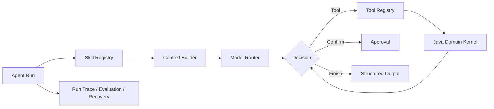

<div align="center">

# Python Health Agent Harness

### Intelligent control flow for the reboot-health system

<p>
  
  
  
  
</p>

**产品智能与任务编排核心，不是简单的模型 HTTP 代理。**

</div>

## 🎯 Role

Python Health Agent Harness 负责：

- 理解任务目标。
- 选择领域 Skill。
- 组装最小必要上下文。
- 调用 ModelProvider。
- 请求 Java 提供的受控 Tool。
- 处理 Tool 结果并继续有限轮次决策。
- 输出候选、解释或确认请求。
- 记录运行摘要、失败分类与评测信息。

Java Health Domain Kernel 仍然负责业务事实、安全规则、权限、确认和领域状态。

## 🧩 Target capabilities



| 能力 | 当前状态 |
|---|---|
| Model Mock | `IMPLEMENTED` |
| Runtime HTTP API | `IMPLEMENTED` |
| 结构化输入输出 | `IMPLEMENTED` |
| Agent Loop | `TODO` |
| Skill Registry | `TODO` |
| Tool Registry | `TODO` |
| Session Runtime | `TODO` |
| Memory Manager | `TODO` |
| Approval Coordinator | `TODO` |
| Evaluation | `TODO` |

> M2.5-A 只验证技术链路。README 中的 Harness 能力表示目标架构，不代表已经全部实现。

## 🔌 Runtime API

| Method | Path | Purpose |
|---|---|---|
| `GET` | `/health` | Runtime 健康检查 |
| `POST` | `/internal/v1/agent-runs/execute` | 执行一次结构化 Mock AgentRun |

当前默认使用稳定、可重复的 `MockProvider`：

- 不接入真实云模型。
- 不访问 PostgreSQL。
- 不直接写 Goal、HealthConstraint、Plan 或 PlanVersion。
- 不直接发布计划或改变确认状态。

## ▶️ Run locally

```bash
cd agent-runtime
python3 -m agent_runtime.server --host 127.0.0.1 --port 8090
```

健康检查：

```bash
curl http://127.0.0.1:8090/health
```

## ✅ Verify

```bash
cd agent-runtime
python3 -m compileall agent_runtime tests
python3 -m unittest discover -s tests
```

测试应逐步覆盖：

- `unit`：状态、Schema、Registry 和策略。
- `contract`：Java Tool Contract 与 Runtime API。
- `scenario`：完整领域场景。
- `eval`：正确性、安全性、Tool 选择和成本变化。

## 🛡️ Hard boundaries

- 不直接访问业务数据库。
- 不将模型输出当作领域事实。
- 不开放任意系统工具。
- 不允许 Agent 自动修改自身代码。
- 不把 onboarding、规划、复盘和记忆堆进一个大 Prompt。
- 不记录完整健康原文、认证信息或无关敏感上下文。

详细规则见 [`AGENTS.md`](AGENTS.md)，系统边界见 [`../docs/architecture.md`](../docs/architecture.md)。
